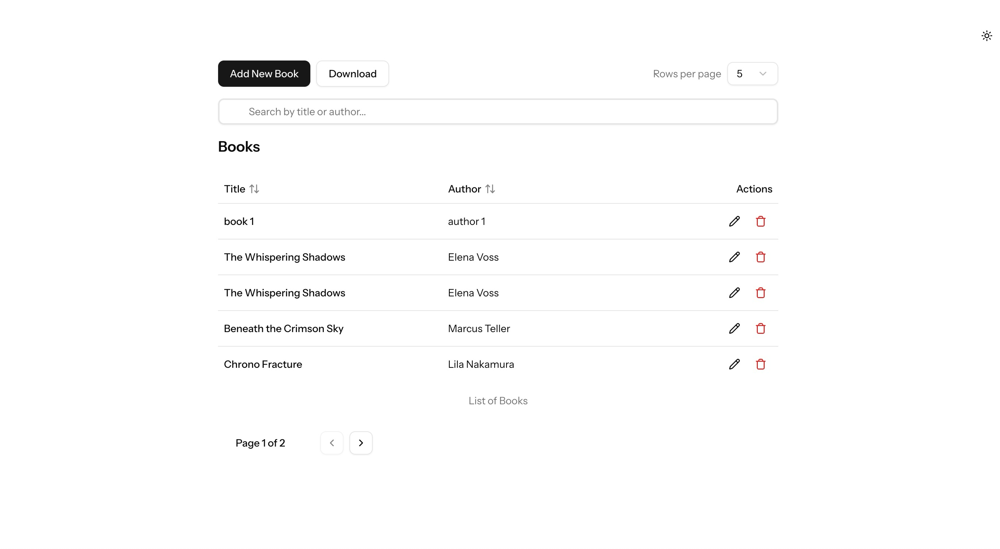
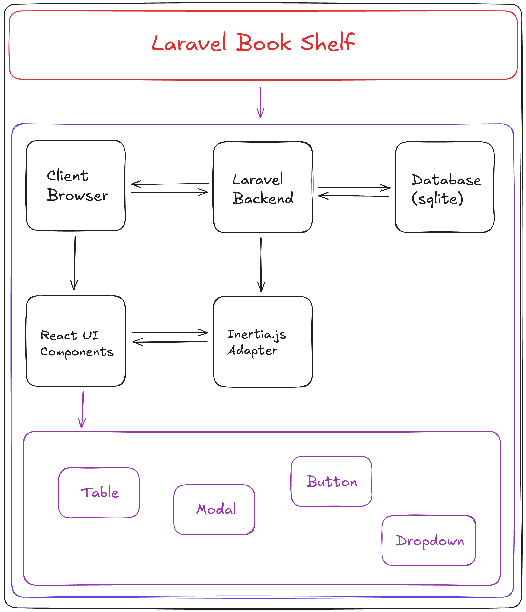

# 📚 Laravel Book Shelf
A modern web application for managing your personal book collection, built with Laravel, React, and Inertia.js.

🌐 **[Live Demo](https://book-shelf.shubhams.dev/)** | 📦 **[GitHub Repository](https://github.com/shubhamku044/laravel-book-shelf)**



## ✨ Features

- 📝 CRUD operations for book management
- 🔍 Search, sort, and filter your book collection
- 🌙 Dark mode support
- 🔔 Modern toast notifications
- 📱 Responsive design for all devices
- 🐳 Docker support for easy setup

## 🏗️ Architecture



The application follows a modern single-page application architecture with server-side rendering:

- **Backend**: Laravel handles API requests and business logic
- **Frontend**: React components with TypeScript and Tailwind CSS
- **Integration**: Inertia.js connects Laravel and React
- **Database**: SQLite for lightweight data storage

## 🚀 Quick Start

## 🛠️ Development Setup

### Option 1: Using Docker (Recommended)

```bash
# Clone the repository
git clone https://github.com/shubhamku044/laravel-book-shelf.git
cd laravel-book-shelf

# Configure environment
cp .env.example .env

# Start Docker containers
docker compose up -d

# Set up application
docker compose exec app composer install
docker compose exec app php artisan key:generate
docker compose exec app php artisan migrate
```

Access at: http://localhost:8080

### Option 2: Local Development

```bash
# Clone and enter project
git clone https://github.com/shubhamku044/laravel-book-shelf.git
cd laravel-book-shelf

# Install dependencies
composer install
npm install

# Configure environment
cp .env.example .env
php artisan key:generate

# Set up database
touch database/database.sqlite
chmod 666 database/database.sqlite
php artisan migrate

# Start development server
composer run dev
```

## 🚢 Deployment

### Deploy to EC2 with Docker

1. **Set up EC2 instance**
   - Launch an Ubuntu EC2 instance
   - Configure security group to allow HTTP (80) and HTTPS (443)

2. **Install Docker and Docker Compose**
   ```bash
   sudo apt update
   sudo apt install docker.io docker-compose
   sudo usermod -aG docker $USER
   ```

3. **Clone and configure the project**
   ```bash
   git clone https://github.com/shubhamku044/laravel-book-shelf.git
   cd laravel-book-shelf
   cp .env.example .env
   # Edit .env for production settings
   ```

4. **Set up SSL certificates**
   ```bash
   # Create directory for certificates
   mkdir -p docker/nginx/ssl
   
   # Install certbot
   sudo apt install certbot python3-certbot-nginx
   
   # Get certificate (replace with your domain)
   sudo certbot certonly --standalone -d book-shelf.shubhams.dev
   
   # Copy certificates
   sudo cp /etc/letsencrypt/live/book-shelf.shubhams.dev/fullchain.pem docker/nginx/ssl/
   sudo cp /etc/letsencrypt/live/book-shelf.shubhams.dev/privkey.pem docker/nginx/ssl/
   sudo chmod -R 755 docker/nginx/ssl
   ```

5. **Deploy with production configuration**
   ```bash
   docker-compose -f docker-compose.prod.yml up -d --build
   ```

## 🧰 Useful Commands

```bash
# Docker operations
docker compose up -d            # Start containers
docker compose down             # Stop containers
docker compose logs -f          # View logs

# Development tools
composer test                   # Run tests
npm run format                  # Format frontend code
npm run lint                    # Lint frontend code
```

## 📁 Project Structure

- `app/` - Laravel application code
- `resources/` - Frontend assets and React components
- `routes/` - Application routes
- `database/` - Database migrations and seeders
- `tests/` - Application tests
